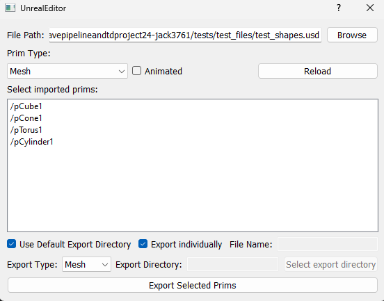

# USD animated prim extraction and import into Unreal Engine

## Project Overview

This project aims to produce a tool that can take a USD scene, and import and access the mesh and camera animations within Unreal Engine 5 (UE5). This has shifted from the original idea from a specific Maya to UE5 tool using USD to a more abstract tool that takes in a general USD file. 

Using the USD Stage Import within UE gives us a USD Stage Actor that possesses a transient level sequence containing all of the animation data within the file. However, this level sequence only allows us to play the entire animation within the sequencer. While we can mute or isolate the tracks using the sequencer tools, we lack the freedom to play their seperate animations from the push of a button. 

This tool allows the user to import a USD file, select the desired prims to import based on their type and if they contain animation to then import individually, or as a group. This is achieved by exporting new usd files to a desired location or within the default location within the UE project, which are then accessed through created UsdStageActors.

## Installation

This tool is built using [Python 3.9.7](https://www.python.org/downloads/release/python-397/) and [Unreal Engine 5.41](https://www.unrealengine.com/en-US/download) and intended for a Windows environment. The packages required can be found in the file requirements.txt and can be installed with `pip install -r requirements.txt`. 

To install, first redirect do your desired directory. Then clone the repo with `git clone git@github.com:NCCA/msccavepipelineandtdproject24-jack3761.git` or alternatively download the zip file.

In your Unreal project, you must first install the required plugins. Go do Edit -> Plugins and search for python. Then select the Python Editor Script Plugin and Sequencer Scripting. Following this, search for USD and select the USD Importer plugin.

Then we have to set up the startup script and the additional python paths. Redirect to Edit -> Project settings and search for python. Here, add a path to the startup script, and enter the path for the ue_menu.py file from the repository. This script sets up the menu to access the tools, and will be run each time this project is started. 

Then, add two additional paths. One of them should lead to the \src directory of this repository to access the required modules. In the next one, you must put the path to your python site packages. This is where your python packages are installed, and is required to be able to access PySide2 to generate the GUI. If you are unsure of how to locate this, in a terminal run `python -c "import site; print(site.getsitepackages())"` and this will show you the path required to copy.

After this, restart the project again, and a menu option will be present at the top of the screen. Here you can access the tools.

## How to use

With the installation complete, you can access the tools straight from the menu. In the menu there will be two options, USD Prim Importer and USD Animation Player.

### USD Prim Importer

- Select the USD file you would like to import
- Choose which prim type you would like to filter to and click reload
- Choose whether you would like only the animated prims or not and click reload
- Xform is mainly used here for animation groups
- Select all of the filtered prims you would like to export
- Use the default export directory within the project folder or select your own
- Choose whether to export individual USD files or a single one
- Select the type the prims will be exported as
- Click export

This will export the new USD files to the specified location and automatically import them as named USDStageActors which can then be interacted with. The animations for these can then be directly accessed with the USD Animation Player. 

### USD Animation Player

- Select the USDStageActor you would like to play the animation of
- Refresh to find changes to the USDStageActors in the scene

This tool is used to easily access the animations of the USDStageActors from a button click rather than going to their object and finding their level sequence. The option to export multiple prims to the same file in the USD Prim Importer provides the option to choose to play multiple animations at the same time.

These tools can optionally be run by using the python editor at the bottom and running `py "your\\path\\to\\src\\ue_importer_gui.py"` or `py "your\\path\\to\\src\\ue_usd_sequence.py"`

## Testing

There is a tests folder which contains the test script and accompanying files. This must be run in Unreal using the command `py "your\\path\\to\\tests\\test_ue_importer_gui.py"`

## Evaluation and Future Work

I have developed a tool that allows a user to enter a USD file and extract individual prims from it to import into Unreal Engine. The animations within these prims can then be directly accessed using the USD Animation Player to access the Level Sequences for each of the generated USDStageActors. Overall, I think that this project has worked successfully to import mesh, camera and xform prims into Unreal Engine individually and quickly.

A known issue with this comes when importing to the default directory within the unreal project, as additional import dialogs show. These are ok and provide more access to the USD functionality, however there is a bug that makes it so none of the buttons can be pressed, and was only fixed by killing the task. Another area that could potentially cause problems is the naming of the areas, and the confusion it may cause. As the tool is both exporting USD Files and then importing them into Unreal. In the ended, I resulted to labelling most of it as exports, as during the development most of the code is working to export USD files and at the end imports them as USDStageActors. However I do acknlowledge that as the tools is labelled as an importer this may be an issue and in future work would be explored to find more suitable naming.

This remains a basic tool that has lots of areas to expand on, largely with more focus to inclusions within the USD file such as materials and exploring the use of other prims as scenes increase in complexity. Additionally, further functionality could be implemented within other DCC's to produce a greater pipeline approach into Unreal.

---

## Research

Reference links throughout this project are listed below

- [Unreal Engine USD Description](https://dev.epicgames.com/documentation/en-us/unreal-engine/universal-scene-description-in-unreal-engine)
- [Unreal Engine Python Description](https://dev.epicgames.com/documentation/en-us/unreal-engine/scripting-the-unreal-editor-using-python?application_version=5.3)
- [Python for Unreal Engine](https://www.youtube.com/watch?v=OwZxr1SMluY&list=PLA5eKtL_PFiMJwn80t4WWlrAdOn-fE3X6&pp=iAQB)
- [Unreal Engine 5 Python Automation Course](https://www.youtube.com/watch?v=mmiV0qKMTio&list=PLKgYiIAqG99cwlb4Y2Pu-cSb_Vw14-t0c&pp=iAQB)
- [Universal Scene Description](https://openusd.org/release/index.html)
- [Unreal Animation Import Pipeline](https://www.youtube.com/watch?v=XvnLMpvGZ34&ab_channel=TonyBowren)
- [UE Python sequencer cookbook](https://dev.epicgames.com/community/learning/knowledge-base/0qK6/unreal-engine-ue4-sequencer-python-cookbook)
- [UE4 Knowledgebase for sequencer scripting](https://forums.unrealengine.com/t/knowledge-base-ue4-sequencer-python-cookbook/265097/10)
- [Animated prim attributes forum](https://forums.developer.nvidia.com/t/get-animated-prim-attributes-per-frame-time/222735/4)
- [Add USD Reference](https://docs.omniverse.nvidia.com/dev-guide/latest/programmer_ref/usd/references-payloads/add-reference.html)
- [UE Set up pyside](https://www.petfactory.se/notes/ue5-python-pyside2/)
- [Creating UE menus in python](https://forums.unrealengine.com/t/making-menus-in-py/144498/7)
- [Adding script to UE menu](https://medium.com/@TechArtCorner/executing-python-scripts-from-unreal-engine-5-menus-90b917981020)
- [More for UE menus](https://www.youtube.com/watch?v=8l6IpQW8k9U&ab_channel=SushantaSantra)
- [Running unit tests in unreal engine](https://forums.unrealengine.com/t/how-to-get-python-unit-tests-to-run-inside-of-the-unreal-editor/618444/4)